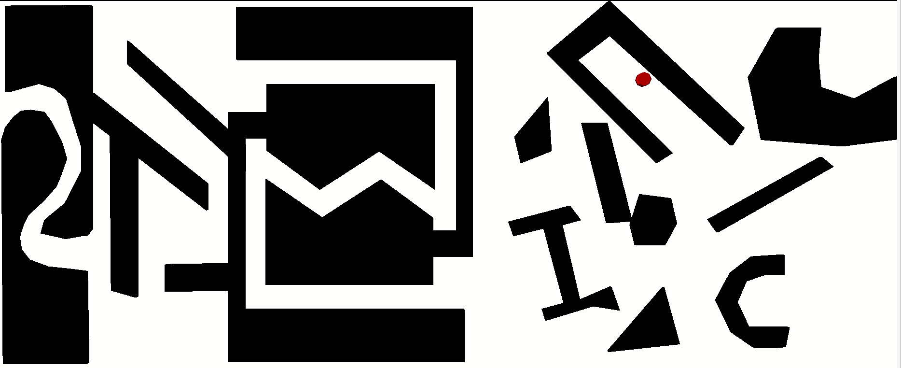

# Heterogeneous

This environment contains an assortment of obstacles of varying sizes and shapes and also includes a winding narrow passage.
The model is available in BYU format, with each piece represented in a separate file.



__Type__: Static 2D

__#Agents__: 1

__Difficulty__: 3/5

__Provided by__: Parasol Lab, Texas A&M University

## Running this benchmark
The ```heterogeneous2D.xml``` file is provided, which will generate the above solution using Obstacle-Based PRM (OBPRM). The xml file also includes other strategies you may want to experiment with.

To run this benchmark using the open-source PPL code, after compiling the executable, run

```
<your_path_to_open-ppl>/build/ppl_mp -f heterogeneous2D.xml
```

|  |  |
| ------ | ------ |
| Code Version       |  OpenPPL main, commit e7f37f4f98e6e70e3c1b8e9cd21729dcb3cdeda4 |
| MPStrategy       |   OBPRM     |
| Sampler(s)       |   UniformRandomFree, ObstacleBased     |

|  |  |
| ------ | ------ |
| Samples       |   7,924    |
| CD Calls       |   3,661,820   |
| Runtime       |    1,136 sec   |
