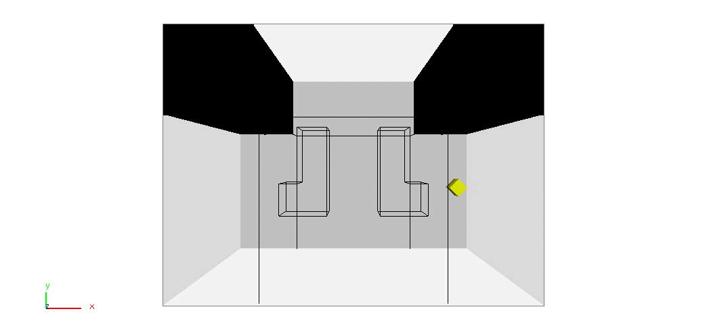

# LTunnel
The L tunnel environment contains two L-shaped passages the robot (also L-shaped) must traverse.
The model is available in BYU format, with each piece represented in a separate file.



__Difficulty__: 3/5

__Provided by__: Parasol Lab

The ```LTunnel.xml``` file is provided, which will generate the above solution using Rapidly-exploring Random Tree (RRT). The xml file also includes other strategies you may want to experiment with.

To run this benchmark using the open-source PPL code, after compiling the executable, run

```
<your_path_to_ppl>/build/ppl_mp -f LTunnel.xml
```
|  |  |
| ------ | ------ |
| Code Version       |  OpenPPL main, commit d4e7d44caf18ff0c9962c9a0f47e18c4220d6747 |
| MPStrategy       |   RRT     |
| Sampler(s)       |   UniformRandomFree, UniformRandom     |

|  |  |
| ------ | ------ |
| Samples       |   1,041    |
| CD Calls       |  82,064  |
| Runtime       |    3.37 sec   |