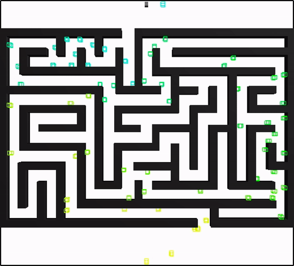

# Maze
The Maze environment consists of a maze that the robot has to traverse.
<!-- The robot is a stick which is considered a rigid body with 6 degrees of freedom. -->



__Type__: Static 2D

__#Agents__: 1

__Difficulty__: 2/5

__Provided by__: Parasol Lab

## Running this benchmark
The ```maze.xml``` file is provided, which will generate the above solution using Obstacle-Based PRM (OBPRM). The xml file also includes other strategies you may want to experiment with.

To run this benchmark using the open-source PPL code, after compiling the executable, run 

```
<your_path_to_ppl>/build/ppl_mp -f maze.xml
```

|  |  |
| ------ | ------ |
| Code Version       |  OpenPPL main, commit d4e7d44caf18ff0c9962c9a0f47e18c4220d6747 |
| MPStrategy       |   OBPRM     |
| Sampler(s)       |   UniformRandomFree, ObstacleBased     |

|  |  |
| ------ | ------ |
| Samples       |    16,913   |
| CD Calls       |   14,633,653    |
| Runtime       |    142 sec    |
