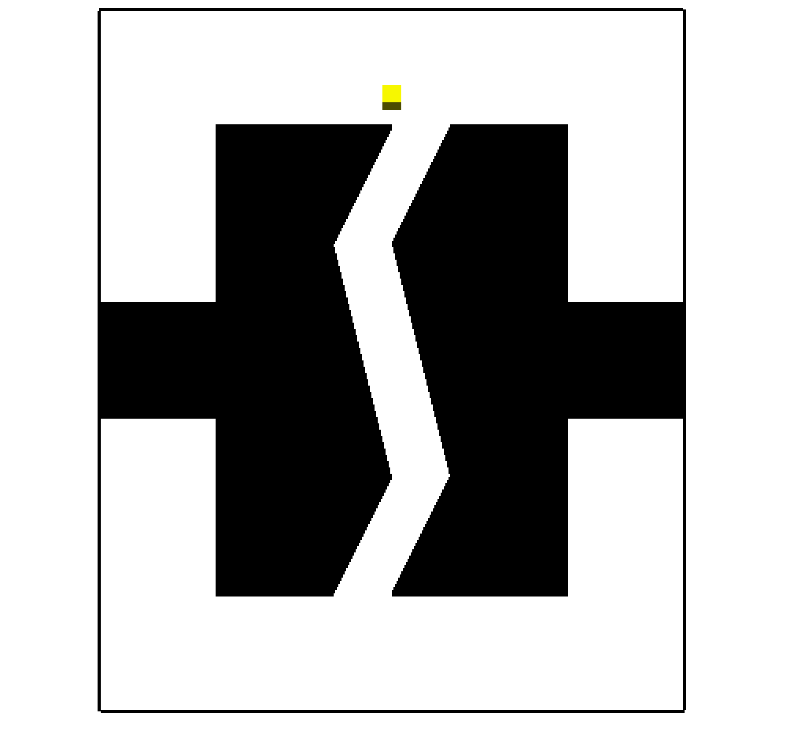

# Heterogeneous

The Zig-Zag environment represents an easy winding narrow passage which fools many sampling-based planners. It is a nice 2D problem, to study qualities of various planners.
The model is available in BYU format, with each piece represented in a separate file.



__Type__: Static 2D

__#Agents__: 1

__Difficulty__: 1/5

__Provided by__: Parasol Lab, Texas A&M University

## Running this benchmark
The ```zigzag.xml``` file is provided, which will generate the above solution using Basic Rapidly exploring Random Tree (RRT). The xml file also includes other strategies you may want to experiment with.

To run this benchmark using the open-source PPL code, after compiling the executable, run

```
<your_path_to_open-ppl>/build/ppl_mp -f zigzag.xml
```

|  |  |
| ------ | ------ |
| Code Version       |  OpenPPL main, commit xxxx |
| MPStrategy       |   RRT     |
| Sampler(s)       |   UniformRandomFree, ObstacleBased     |

|  |  |
| ------ | ------ |
| Samples       |   xxxx    |
| CD Calls       |   xxxx   |
| Runtime       |    xxxx   |
