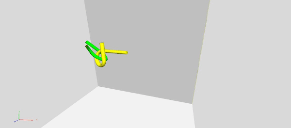

# Alpha 1.6
The alpha puzzle benchmark is a motion planning problem containing a narrow passage. The puzzle consists of two tubes, each twisted into an alpha shape; one tube is the obstacle and the other the moving object (robot). The objective is to separate the intertwined tubes.

In order for the problem to be solved a complex set of translation and orientation movements need to take place within the narrow passage. Computationally the narrow passage needs to be adequately mapped which is a difficult problem as this valid space is fairly difficult to generate samples in.

Each tube consists of 1008 triangles. The models are given in world coordinates in which the `robot' and `obstacle' tubes are in an intertwined configuration.

The different versions of this problem were obtained by scaling the obstacle tube along the z-axis by a constant factor greater than 1, which had the effect of widening the gap between the two prongs of the alpha. Thus, the hardest version is the original problem, and the easiest version is the 1.6 scaled version. We have solved the 1.6 version here. 



__Type__: Static 3D

__#Agents__: 1

__Difficulty__: 5/5

__Provided by__: Boris Yamrom, GE Corporate Research & Development Center

## Running this benchmark
The ```alpha.xml``` file is provided, which will generate the above solution using Obstacle-Based PRM (OBPRM). The xml file also includes other strategies you may want to experiment with.

To run this benchmark using the open-source PPL code, after compiling the executable, run

```
<your_path_to_open-ppl>/build/ppl_mp -f alpha.xml
```

|  |  |
| ------ | ------ |
| Code Version       |  OpenPPL main, commit d4e7d44caf18ff0c9962c9a0f47e18c4220d6747 |
| MPStrategy       |   OBPRM     |
| Sampler(s)       |   UniformRandomFree, ObstacleBased     |

|  |  |
| ------ | ------ |
| Samples       |   35,404    |
| CD Calls       |   264,501,104   |
| Runtime       |    2,550 sec   |

